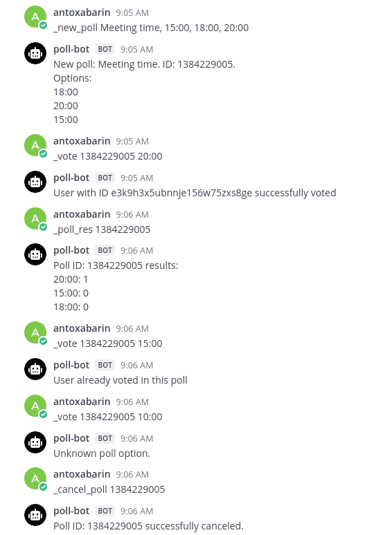

# mattermost-poll-bot

## Bot commands

```bash
# Create new poll
_new_poll <title>, <option 1>, <option 2>, ..., <option N>

# Cancel poll (poll creator's feature)
_cancel_poll <poll ID>

# Vote in poll
_vote <poll ID> <option>

# Get poll results
_poll_res <poll ID>
```



## Build

#### 1. Fetch git submodules:

In the root folder run this command:

```bash
git submodule update --init --recursive
```

#### 2. Run mattermost with docker

```bash
cd docker
```

Create config:
```bash
cp env.example .env
```

Edit `docker/.env`: 
- `DOMAIN`: 127.0.0.1 
- `MATTERMOST_IMAGE_TAG`: latest

Then create required directories and set permissions:

```bash
mkdir -p ./volumes/app/mattermost/{config,data,logs,plugins,client/plugins,bleve-indexes}
sudo chown -R 2000:2000 ./volumes/app/mattermost
```

Deploy mattermost:

```bash
docker compose -f docker-compose.yml -f docker-compose.without-nginx.yml up -d
```

Mattermost url: http://127.0.0.1:8065/

To shutdown deployment run this command (in `docker` folder):

```bash
docker compose -f docker-compose.yml -f docker-compose.without-nginx.yml down
```

[Create bot](https://developers.mattermost.com/integrate/reference/bot-accounts/), copy it's token.

#### 3. Run bot and Tarantool

In the root folder:

```bash
docker-compose up --build
```

#### Manual build

Create `.env` file in the root directory and add these variables:

- `BOT_TOKEN`: Bot token from Mattermost
- `BOT_PORT`: port to run Bot on
- `MM_URL`: Mattermost server URL
- `DB_HOST`: [Tarantool](https://tarantool.io) server host
- `DB_PORT`: Tarantool server port

#### Build and run poll-bot

From the root folder:

```bash
cd poll_bot
go mod tidy
cd src
go run .
```
